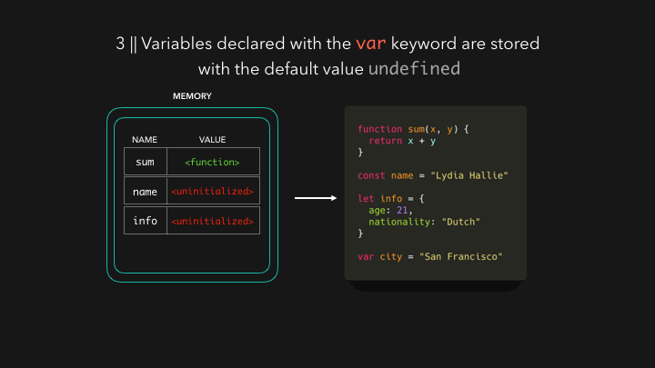

# Hoisting





Поднятие или _hoisting_  — это механизм в JavaScript в котором переменные и объявления функций передвигаются вверх своей области видимости перед тем, как код будет выполнен.

Как следствие, это означает то, что совершенно неважно где функция или переменные были объявлены, они передвигаются вверх своей своей области видимости, вне зависимости локальная она или же глобальная.

Стоит отметить то, что механизм “поднятия” передвигает только объявления функции или переменной. Назначения же остаются на своих местах.

В общем, если вы когда-либо удивлялись почему вы могли вызывать функции перед тем, как вы написали их в своем коде, то читайте дальше.

**`Undefined` против `ReferenceError`**

Перед тем, как мы начнем серьёзно углубляться в вопрос, давайте определим несколько вещей.

```javascript
 console.log(typeof variable); // Выводит: undefined
```

Это приведет нас к первому заключению. В JavaScript необъявленной переменной назначается значение `undefined` при исполнении, а так же и тип `undefined`.

Вторым заключением будет:

```javascript
console.log(variable); // Выводит: ReferenceError: variable is not defined
```

В JavaScript ReferenceError появляется при попытке доступа к предварительно необъявленной переменной.

Поведение JavaScript при работе с переменными становится довольно утонченным делом из-за «поднятия». Мы увидим это более детально в последующих секциях.

**«Поднятие» переменных**

Ниже вы видите цикл работы JavaScript, показывающий последовательность, в которой происходит объявление и инициализация переменных.


Тем не менее так как JavaScript позволяет нам как объявлять, так и инициализировать наши переменные одновременно, это самый используемый пример:

```javascript
var a = 100;
```

Запомните и держите в уме одну важную вещь, JavaScript непреклонно сначала объявляет, а затем инициализирует наши переменные.

Как упоминалось ранее, все переменные и объявления функций поднимаются наверх своей области видимости. Мне также стоит добавить, что объявления переменных происходит перед тем, как код будет выполнен.

Тем не менее, с другой стороны, необъявленные переменные не существуют до тех пор, пока код назначающий их не будет выполнен. Следовательно, назначение значения для необъявленной переменной, тут же создаёт её как глобальную переменную, когда назначение будет выполнено. Это означает то, что все необъявленные переменные это глобальные переменные.

Чтобы продемонстрировать такое поведение, давайте посмотрим на следующий код:

```javascript
function hoist() {
    a = 20;
    var b = 100;
}

hoist();
console.log(a);

/*
Доступ как к глобальной переменной вне функции hoist()
Выводит: 20
*/

console.log(b);

/*
Как только она была назначена, она заключена в рамки области видимости функции hoist(). Что означает то, что мы не можем вывести её за рамки функции.
Вывод: ReferenceError: b is not defined
*/
```

Так как это одна из причуд того, как JavaScript работает с переменными, рекомендуется всегда объявлять их, вне зависимости где они, в функции или в глобальной области видимости.

Это ясно описывает то, как интерпретатор должен работать с ними во время выполнения.

## **ES5**

### **var**

Область видимости переменной объявляется со словом `var`, показывая его текущий контекст выполнения. Это подходит как и для замыкания функции, так и для переменных объявленных вне любой функции, то есть глобальных. Давайте посмотрим на несколько примеров, чтобы понять, что это означает.

**Глобальные переменные**

```javascript
console.log(hoist); // Output: undefined
var hoist = 'The variable has been hoisted.';
```

Мы ожидали, что результат в логе будет: `ReferenceError: hoist is not defined` , но вместо этого нам вывело `undefined`.

_Почему так произошло?_

JavaScript «поднял» объявление переменной. Это то, как это выглядит в коде интерпретатора:

```javascript
var hoist;
console.log(hoist); // Вывод: undefined
hoist = 'The variable has been hoisted.';
```

По-этому, мы можем использовать переменные перед тем как мы объявим их. Тем не менее, нам нужно быть аккуратными, так как «поднятая» переменная инициализируется со значением `undefined`. Лучшим вариантом было бы объявить и инициализировать нашу переменную перед использованием.

**Переменные в области видимости функции**

Как мы видели до этого, переменные в глобальной области видимости поднимаются вверх. Дальше, давайте посмотрим на то, как ведут себя переменные в функциях при «поднятии».

```javascript
function hoist() {
    console.log(message);
    var message= 'Hoisting is all the rage!';
}
hoist();
```

Предположите, что нам выдаст эта функция? Если вы подумали — `undefined`, то вы оказались правы. Если нет, то не переживайте, мы скоро доберемся до сути.

Вот как интерпретатор видит код выше:

```javascript
function hoist() {
    var message;
    console.log(message);
    message='Hoisting is all the rage!';
}
hoist(); // Вывод: undefined
```

Объявление переменной `var message`, область видимости которой заканчивается в функции `hoist()`, «поднимается» наверх функции.

Чтобы избежать таких ловушек, нам нужно убеждаться в том, что мы объявляем и инициализируем переменные перед их использованием.

```javascript
function hoist() {
    var message='Hoisting is all the rage!';
    return (message);
}
hoist(); // Вывод: Hoisting is all the rage!
```

### **Strict Mode или «Строгий режим»**

Спасибо такой полезной вещи как, strict-mode в es5 версии JavaScript, с помощью которой вы можете быть внимательнее при объявлении переменных. Включая `strict mode,` мы делаем выбор на ограниченном варианте JavaScript который не будет возиться с использованием переменных перед их объявлением.

### **Запуск кода в strict mode:**

* Устраняет некоторые скрытые ошибки JavaScript, изменяя их на явную выдачу ошибок, которые будут выданы интерпретатором.
* Устраняет ошибки, которые затрудняют движкам JavaScript выполнять оптимизации.
* Запрещает некоторые синтаксисы, которые с большой вероятностью будут определены в будущих версиях JavaScript.

Мы включаем «строгий режим», заранее указывая в нашем файле или функции следующее:

```javascript
'use strict';
// Или
"use strict";
```

Давайте протестируем.

```javascript
'use strict';
console.log(hoist); // Output: ReferenceError: hoist is not defined
hoist = 'Hoisted';
```

Мы видим, что вместо того, чтобы указать, что мы пропустили объявление нашей переменной, `use strict` остановил нас на пути, выдав `Reference error`. Попробуйте это без использования use strict и понаблюдайте что произойдет.

Тем не менее, use-strict ведет себя по разному в разных браузерах, так что будет вполне благоразумно провести тестирование функционала перед использованием в работе.

## **ES6**

Тут нам представляет интерес то, как этот стандарт влияет на объявление и инициализацию JavaScript переменных.

### **let**

Перед тем как идти дальше, нужно отметить то, что переменные объявленные как `let` заключены в область видимости блока, а не функции. Это очень важно, но это не должно нас сейчас беспокоить.

Вкратце, это просто означает то, что область видимости переменной привязана к блоку, в котором она объявлена, а не к функции в которой она объявлена.

Давайте посмотрим на поведение `let`.

```javascript
console.log(hoist); // Output: ReferenceError: hoist is not defined …
let hoist = 'The variable has been hoisted.';
```

Как и прежде, с `var`, мы ожидаем, что выведется в лог undefined. Но тем не менее, так как es6 `let` не дружелюбно относится к необъявленным переменным, интерпретатор выдает нам Reference ошибку.

Это еще раз доказывает, что надо сначала объявлять наши переменные.

Тем не менее, нам нужно всё еще быть аккуратными. Пример ниже, выдаст `undefined` вместо `Reference error`.

```javascript
let hoist;
console.log(hoist); // Вывод: undefined
hoist = 'Hoisted';
```

Следовательно, чтобы быть очень осторожными, нам нужно сначала объявить переменную, а потом назначить ей значение и только потом уже использовать её.

### **const**

`const` был представлен в es6 для того, чтобы можно было сделать неизменные переменные. Да, именно это, переменные значение которых не может быть модифицировано или переназначено.

С `const`, как и с `let`, переменные поднимаются наверх блока.

Давайте посмотрим что происходит, если мы попытаемся переназначить значение, прикрепленное к const переменной.

```javascript
const PI = 3.142;
PI = 22/7; // Let's reassign the value of PI
console.log(PI); // Output: TypeError: Assignment to constant variable.
```

Как `const` изменяет объявление переменной? Давайте посмотрим.

```javascript
console.log(hoist); // Output: ReferenceError: hoist is not defined
const hoist = 'The variable has been hoisted.';
```

Как и с `let`, вместо тихого спокойного выхода с `undefined`, интерпретатор сохраняет нас выдавая `Reference error`.

Тоже самое происходит, при использовании `const` в функциях.

```javascript
function getCircumference(radius) {
    console.log(circumference)
    circumference = PI*radius*2;
    const PI = 22/7;
}
getCircumference(2) // ReferenceError: circumference is not defined
```

С `const`, es6 идет дальше. Интерпретатор выдает ошибку, если мы используем константу перед объявлением или её инициализацией.

Наш линтер, быстренько информирует нас об этом просчете:

```javascript
PI was used before it was declared, which is illegal for const variables.
```

Глобально,

```javascript
const PI;
console.log(PI); // Ouput: SyntaxError: Missing initializer in const declaration
PI=3.142;
```

Следовательно, константные переменные должны быть объявлены и инициализированы перед использованием.


Как пролог к этой секции, важно заметить, что JavaScript «поднимает» переменные `let` и `const`. Разница тут в том, как он инициализирует их. Переменные объявленные с `let` и `const` остаются неинициализированными в начале выполнения, в то время как переменные объявленные с `var` инициализируются со значением `undefined`.


## **Поднятие в функциях**

JavaScript функции могут классифицироваться как объявленные функции, так и функциональные выражения. Тут мы узнаем как «поднятие» влияет на оба типа.

### **Объявленные функции**

Они имеют следующую форму и полностью поднимаются вверх скрипта. Теперь понятно почему JavaScript позволяет нам привлекать функции прежде, чем мы их объявим.

```javascript
hoisted(); // Output: 'This function has been hoisted.'
function hoisted() {
    console.log('This function has been hoisted.');
};
```

Давайте попробуем комбинацию того и другого.

```javascript
expression(); // Ouput: TypeError: expression is not a function
var expression = function hoisting() {
    console.log('Will this work?');
};
```

Как мы можем видеть выше, объявление переменной var expression поднимается, но его назначение функции нет. Следовательно, интерпретатор выдаст `TypeError` как увидит expression в виде переменой, а не функции.

### **Порядок по приоритетам**

Очень важно помнить несколько вещей, объявляя JavaScript функции и переменные:


* Назначение переменных имеет приоритет перед объявлением функции.
* Объявление функции имеет приоритет перед объявлением переменной.
* Объявления функций «поднимаются» над объявлениями переменных, но не над назначениями переменным.


Давайте посмотрим, как это работает.

Назначение переменной над объявлением функции.

```javascript
var double = 22; // Назначение переменной
function double(num) { // объявление функции
    return (num*2);
}
console.log(typeof double); // Вывод: число
```

Объявление функции над объявлением переменной

```javascript
var double;
function double(num) { // Объявление функции
    return (num*2);
}
console.log(typeof double); // Вывод: function
```

Даже если мы изменим позиции объявлений, JavaScript интерпретатор все равно бы взял `double` функцию.

### **«Поднятие» классов**

Классы в JavaScript могут также классифицироваться как объявления и выражения.

#### **Объявления классов**

Так же, как и свои коллеги функции, JavaScript классы при объявлении «поднимаются». Тем не менее, они остаются _неинициализированными до определения_. Это определенно говорит о том, что вы ~~можете~~ должны объявить класс перед тем, как использовать его.

```javascript
var Frodo = new Hobbit();
Frodo.height = 100;
Frodo.weight = 300;
console.log(Frodo); // Output: ReferenceError: Hobbit is not defined

class Hobbit {
    constructor(height, weight) {
        this.height = height;
        this.weight = weight;
    }
}
```

Уверен, что вы заметили то, что вместо `undefined` мы получили `Reference error`. Это доказательство подвергает сомнению нашу позицию, что объявления классов «поднимаются».

Если мы взглянем на линтер, то там мы увидим полезный совет.

```text
Hobbit was used before it is declared, which is illegal for class variables
```

По-этому, чтобы получить доступ к объявлению класса, вам нужно сначала его объявить.

```javascript
class Hobbit {
    constructor(height, weight) {
        this.height = height;
        this.weight = weight;
    }
}

var Frodo = new Hobbit();
Frodo.height = 100;
Frodo.weight = 300;

console.log(Frodo); // Вывод: { height: 100, weight: 300 }
```

#### **Выражения классов**

Также как и свои коллеги по функциям, выражения классов не «поднимаются».

Вот пример анонимного варианта выражения класса.

```javascript
var Square = new Polygon();
Square.height = 10;
Square.width = 10;

console.log(Square); // Output: TypeError: Polygon is not a constructor

var Polygon = class {
    constructor(height, width) {
        this.height = height;
        this.width = width;
    }
};
```

А вот пример с названным выражением класса.

```javascript
var Square = new Polygon();
Square.height = 10;
Square.width = 10;

console.log(Square); // Output: TypeError: Polygon is not a constructor

var Polygon = class Polygon {
    constructor(height, width) {
        this.height = height;
        this.width = width;
    }
};
```

А вот правильный порядок:

```javascript
var Polygon = class Polygon {
    constructor(height, width) {
        this.height = height;
        this.width = width;
    }
};

var Square = new Polygon();

Square.height = 10;
Square.width = 10;

console.log(Square);
```

**Предостережение**

Есть много споров о JavaScript es6 `let`, `const` переменных и классах, о том что они «поднимаются», приблизительно «поднимаются» или не «поднимаются» вообще. Некоторые утверждают, что они на самом деле «поднимаются», но не инициализируются, в то время как некоторые утверждают то, что они не «поднимаются вообще».

**Заключение**

Давайте сложим то, что мы изучили только что:

1. Используя es5 переменную `var`, попытки использования необъявленных переменных приведут к тому, что переменной будет объявлено значение `undefined` при «поднятии».
2. Используя переменные es6 `let` и `const`, использование переменных приведет к `Reference Error`, потому что переменная останется неинициализированной при выполнении.

Тем не менее,

1. Нам нужно взять в привычку, объявлять и инициализировать JavaScript переменные перед использованием
2. Использование strict mode в JavaScript es5 может помочь выявить необъявленные переменные.


Разница между _объявлением функции_ \(_function declaration_\) и _объявлением класса_ \(_class declaration_\) в том, что _объявление функции_ совершает подъём \([hoisted](https://developer.mozilla.org/ru/docs/%D0%A1%D0%BB%D0%BE%D0%B2%D0%B0%D1%80%D1%8C/%D0%9F%D0%BE%D0%B4%D0%BD%D1%8F%D1%82%D0%B8%D0%B5)\), в то время как _объявление класса_ — нет.


{% embed url="https://developer.mozilla.org/ru/docs/Web/JavaScript/Guide/Grammar\_and\_Types\#%D0%9F%D0%BE%D0%B4%D0%BD%D1%8F%D1%82%D0%B8%D0%B5\_%D0%BF%D0%B5%D1%80%D0%B5%D0%BC%D0%B5%D0%BD%D0%BD%D1%8B%D1%85" %}

