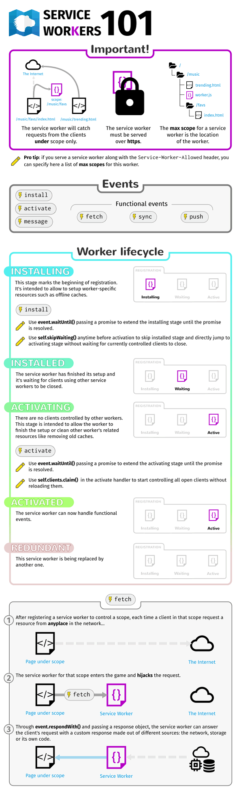

# Service Workers

[MDN](https://developer.mozilla.org/ru/docs/Web/API/Service_Worker_API/Using_Service_Workers)

Используя Service Worker, вы можете без труда получить приложение использующее в первую очередь кешированные ресурсы, предоставляя тем самым поведение по-умолчанию в автономном режиме, до того как будет получено по сети больше данных \(такой подход называется [Offline First](http://offlinefirst.org/)\). Так обычно работают нативные приложения, что часто является причиной выбора пользователя в их пользу.

